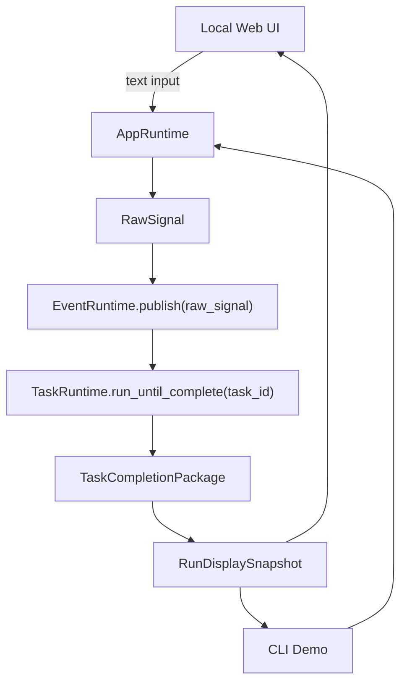
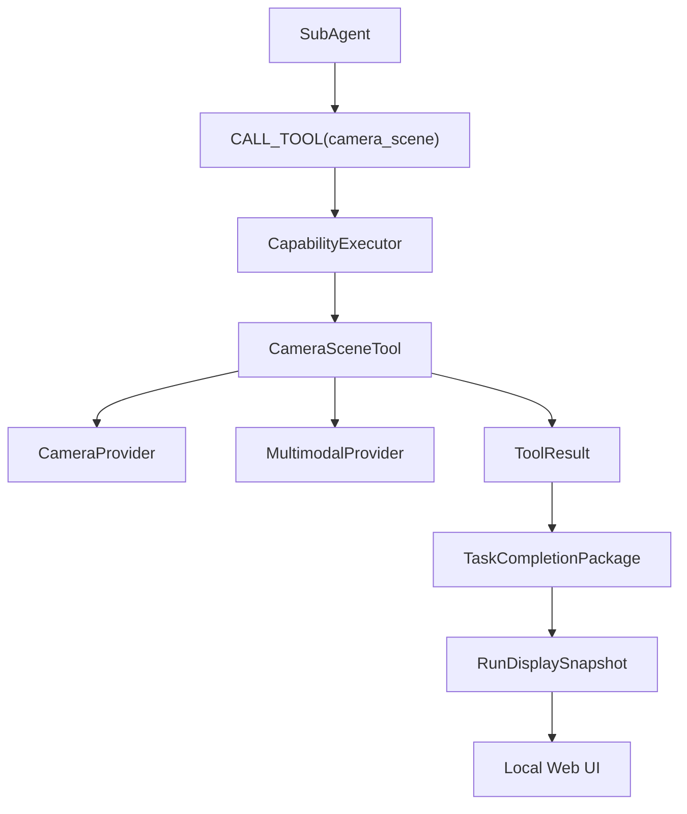

# Ella Runtime PRD 4：交互式本地界面与 Demo 解耦

## 1. 背景

Ella 当前已经具备一条可运行的 Runtime 主链路：

```text
RawSignal
→ EventRuntime
→ TaskRuntime
→ SubAgent
→ CapabilityExecutor
→ ToolResult
→ FinalResponseGenerator
→ TaskCompletionPackage
→ MemoryManager
→ RunDisplaySnapshot / CLI Output / LocalPageViewer
```

PRD 3 已经完成 Prompt Engine、最终回答生成、运行展示快照和静态本地页面。下一步不应该让页面绕过 Runtime，也不应该让 `demo/web_ui.py` 复制 `demo/cli_demo.py` 的应用装配逻辑。

PRD 4 的目标是：

```text
先做一个薄的本地交互界面，
再抽出 CLI 和 Web UI 共用的 AppRuntime 应用入口，
最后让页面通过 AppRuntime 提交输入并展示 Runtime 结果。
```

核心原则：

```text
Runtime 产生数据。
AppRuntime 作为应用入口封装装配和提交。
页面只提交输入和展示 RunDisplaySnapshot。
页面不能成为新的 Runtime。
```

## 2. 产品目标

PRD 4 要让用户可以在本地页面中：

1. 输入文字。
2. 提交给 Ella Runtime。
3. 看到用户输入和转写文本。
4. 看到任务目标。
5. 看到摄像头捕获画面或明确的画面状态。
6. 看到视觉总结、可见物体和工具结果摘要。
7. 看到实际输入给 LLM 的 prompt。
8. 看到 Ella 的最终回答。

同时，CLI demo 必须继续可运行，并逐步改为和 Web UI 共用同一个应用装配入口。

## 3. 非目标

PRD 4 不实现：

- 公网 Web 服务。
- 用户登录、权限系统或数据库。
- WebSocket、实时刷新或任务状态流。
- 持续摄像头直播。
- 浏览器直接打开摄像头。
- always-listening 麦克风。
- 并发任务调度。
- 新的 Runtime 生命周期。
- 新的 Agent 策略。
- 新的工具执行逻辑。
- 页面直接调用摄像头、LLM、工具或 MemoryManager。

第一版 Web UI 是本地开发和演示界面，不是生产 Web 产品。

## 4. 架构原则

### 4.1 页面不是 Runtime

Web UI 后端只允许调用一个应用级入口：

```python
app_runtime.run_text_with_display(text)
```

页面后端不应该知道这些内部组件：

```text
EventRuntime
TaskRuntime
SubAgent
CapabilityExecutor
CameraSceneTool
LLMProvider
MemoryManager
TaskSessionManager
```

### 4.2 AppRuntime 是应用装配边界

`AppRuntime` 是 CLI 和 Web UI 共用的薄 facade。它可以负责：

- 创建或持有 `DemoRuntime` 当前已有的应用装配。
- 接收文本输入。
- 创建 `RawSignal`。
- 调用 `EventRuntime.publish(raw_signal)`。
- 调用 `TaskRuntime.run_until_complete(task_id)`。
- 返回 `RunDisplaySnapshot` 和可选 CLI 输出。

`AppRuntime` 不应该实现新的 Runtime 状态机，也不应该绕过 EventRuntime 或 TaskRuntime。

### 4.3 Runtime 仍然是唯一任务管线

文字提交后的主链路仍然是：

```text
text
→ RawSignal
→ EventRuntime.publish()
→ TaskRuntime.run_until_complete()
→ TaskCompletionPackage
→ RunDisplaySnapshot
```

### 4.4 摄像头画面来自 ToolResult / Snapshot

页面展示的画面不能由浏览器直接打开摄像头获得。

画面来源必须是：

```text
CameraSceneTool
→ ToolResult
→ TaskCompletionPackage
→ RunDisplaySnapshot
→ Web UI
```

如果当前 Runtime 结果中没有安全的 frame 引用或 data URI，应单独扩展 `RunDisplaySnapshot`，不要让 UI 直接调用 `CameraProvider`。

### 4.5 本地 Web 安全边界

Web UI 第一版必须遵守：

```text
默认绑定 127.0.0.1。
不得默认绑定 0.0.0.0。
不要求公网访问。
```

所有渲染到 HTML 的用户输入、模型输出、prompt、tool summary、scene summary、final response 都必须 HTML escape。

页面展示图片时，只允许：

```text
data:image/...;base64,...
```

或受控 display 输出目录内的相对路径。

不得允许：

```text
file://...
/Users/...
绝对路径
../ 路径穿越
任意本地文件读取
```

## 5. 目标数据流



摄像头画面数据流：



## 6. PR 顺序

PRD 4 必须按小 PR 推进：

```text
PR 4.1 Web UI shell
PR 4.2 Extract minimal AppRuntime facade
PR 4.3 Web UI submits text through AppRuntime
PR 4.4 Snapshot supports captured frame display data
PR 4.5 Web UI displays captured frame
```

这个顺序的目的：

1. 先做页面外壳，不碰 Runtime。
2. 先抽 AppRuntime，避免 Web UI 复制 CLI 装配。
3. 再让 Web UI 只调用 AppRuntime。
4. 再补摄像头画面展示数据。
5. 最后让页面展示画面。

## 7. PR 4.1：本地 Web UI Shell

目标：

```text
增加一个本地 Web UI 外壳，展示输入、视觉、Prompt、Agent 和 Answer 区域。
```

允许文件：

```text
demo/web_ui.py
demo/static/web_ui.html
tests/demo/test_web_ui_shell.py
```

不得修改：

```text
runtime/
agent/
sessions/
providers/
devices/
tools/
memory/
demo/cli_demo.py
```

要求：

- 可以渲染空状态或传入的 `RunDisplaySnapshot`。
- 包含文字输入框和提交按钮占位。
- 包含 `Input`、`Vision`、`Prompt Sent to LLM`、`Agent`、`Answer` 区域。
- 不实现提交 Runtime。
- 不调用 provider、device、tool、memory。
- 不打开摄像头或麦克风。
- 不使用 `Reasoning`、`Chain of Thought`、`Model Thinking` 作为 prompt 标题。
- 所有 HTML 文本必须 escape。

## 8. PR 4.2：抽出 AppRuntime Facade

目标：

```text
抽出 CLI 和 Web UI 后续共用的应用装配入口。
```

允许文件：

```text
demo/app_runtime.py
demo/cli_demo.py
tests/demo/test_app_runtime_facade.py
```

不得修改：

```text
runtime/
agent/
sessions/
providers/
devices/
tools/
memory/
demo/web_ui.py
```

要求：

- 新增 `AppRuntime` 或等价 facade。
- 提供 `create_default()`。
- 提供 `run_text_with_display(text)`。
- 内部复用现有 `DemoRuntime` / Runtime 装配逻辑。
- `cli_demo.py` 可以改为调用 `AppRuntime`。
- 保持 `python main.py` 可运行。
- 保持 CLI 输出基本形状。
- 不改变 Runtime 内部行为。
- 不改变工具、provider、device、memory 行为。

## 9. PR 4.3：Web UI 通过 AppRuntime 提交文本

目标：

```text
让本地 Web UI 可以提交一段文字，调用 AppRuntime，并渲染 RunDisplaySnapshot。
```

允许文件：

```text
demo/web_ui.py
demo/static/web_ui.html
tests/demo/test_web_ui_text_submit.py
```

不得修改：

```text
runtime/
agent/
sessions/
providers/
devices/
tools/
memory/
demo/cli_demo.py
demo/app_runtime.py
```

要求：

- Web UI 后端只调用 `AppRuntime.run_text_with_display(text)`。
- 不直接调用 EventRuntime 或 TaskRuntime。
- 不直接创建 TaskSession。
- 不直接选择 skill。
- 不直接调用 tools。
- 不直接调用 LLMProvider。
- 不直接写 memory。
- 默认绑定 `127.0.0.1`。
- 不默认绑定 `0.0.0.0`。
- 首版同步等待任务完成即可，不实现 WebSocket、streaming 或并发调度。

## 10. PR 4.4：RunDisplaySnapshot 支持捕获画面展示数据

目标：

```text
让 RunDisplaySnapshot 可以携带安全的摄像头捕获画面展示数据或引用。
```

允许文件：

```text
demo/display_snapshot.py
tests/demo/test_display_snapshot_frame.py
```

不得修改：

```text
tools/
runtime/
agent/
sessions/
providers/
devices/
memory/
demo/web_ui.py
demo/cli_demo.py
demo/app_runtime.py
```

要求：

- 支持 display-safe captured frame 字段。
- 序列化保持确定性。
- 不调用 Runtime、provider、device、tool 或 memory。
- 不打开摄像头。
- 不长期保存 raw media，除非已有设置明确允许。
- 图片引用只允许安全 data URI 或受控相对路径。
- 拒绝或清理 `file://`、绝对路径、`../` 路径穿越。

## 11. PR 4.5：Web UI 展示摄像头捕获画面

目标：

```text
让 Web UI 从 RunDisplaySnapshot 中展示摄像头捕获画面或安全占位。
```

允许文件：

```text
demo/web_ui.py
demo/static/web_ui.html
tests/demo/test_web_ui_frame_display.py
```

不得修改：

```text
runtime/
agent/
sessions/
providers/
devices/
tools/
memory/
demo/cli_demo.py
demo/app_runtime.py
demo/display_snapshot.py
```

要求：

- 如果 snapshot 有安全 frame data 或 reference，则展示画面。
- 如果没有画面，则展示清晰的 `image_status`。
- 展示 scene summary 和 visible items。
- 不调用 CameraSceneTool。
- 不调用 CameraProvider。
- 不让浏览器 request camera permission。
- 不实现实时摄像头流或 WebSocket。

## 12. 完成后的目标形态

完成 PRD 4 后，系统入口应该是：

```text
CLI Demo
→ AppRuntime
→ EventRuntime
→ TaskRuntime
→ RunDisplaySnapshot
→ CLI Output
```

以及：

```text
Local Web UI
→ AppRuntime
→ EventRuntime
→ TaskRuntime
→ RunDisplaySnapshot
→ HTML Display
```

Web UI 和 CLI 都不应该重新编排 Runtime 内部步骤。

## 13. 风险与注意事项

1. 不要让 Web UI 复制 `cli_demo.py` 的 Runtime 装配。
2. 不要让 Web UI 直接调用摄像头。
3. 不要让 Web UI 直接调用 LLM。
4. 不要让 Web UI 直接创建 TaskSession。
5. 不要在 PR 4.1 就引入复杂框架。
6. 不要默认绑定 `0.0.0.0`。
7. 所有 HTML 文本必须 escape。
8. 图片引用必须防路径穿越。
9. 不要引入 WebSocket、实时流或并发任务调度。
10. 如果一个 PR 需要扩大 allowed files，停止并拆成后续 PR。
