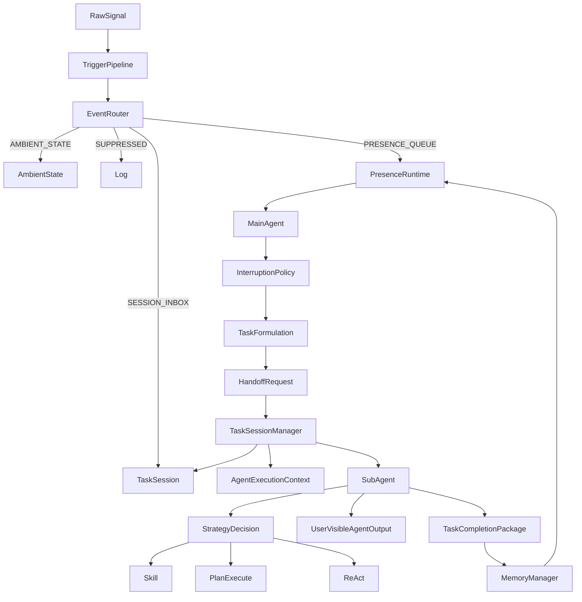

# Ella架构文档

## 1. 架构概览（Architecture Overview）

Ella是一个 Agent Native 的 AI 生活伴侣原型。它不是单一聊天机器人，也不是固定 workflow 系统，而是一个 Agent Runtime Harness，用来验证事件进入、事件路由、Presence Runtime、任务交接、隔离执行、用户可见输出和 memory 管理的完整生命周期。

这份文档描述的是 Ella Runtime 的目标架构。MVP 可以使用 CLI 输入、mock tools、mock skills 和本地 `memory.md` 来验证架构闭环，但不能因为实现较薄就削弱架构概念。

高层链路如下：

```text
Raw Signal
→ Event Trigger Pipeline
→ Configurable Event Stages
→ Session-aware Event Router
→ Configurable Route Destinations
→ Presence Runtime
→ Interruption Policy
→ Task Formulation
→ Task Handoff
→ TaskSessionManager
→ TaskSession
→ AgentExecutionContext
→ SubAgent / Task Agent Runner
→ Task Decomposition / Execution Strategy Selection
→ Task Execution
→ TaskCompletionPackage
→ Memory Manager
→ Back to Presence Runtime
```

这条链路支持：

- event ingestion
- event routing
- presence runtime
- interruption policy
- task formulation
- task handoff
- isolated TaskSession
- AgentExecutionContext
- SubAgent execution
- strategy selection
- task completion package
- memory management

## 2. 核心设计原则（Core Design Principles）

- **事件驱动，而不是主动轮询世界**：Ella 不持续主动观察世界；外部输入先成为 RawSignal，再经事件管线进入系统。
- **Presence Runtime 是事件等待与分发循环**：它不是一个巨大的 `while True` thinking loop。
- **Main Agent 不直接接触外部环境**：摄像头、麦克风、天气、文件等能力必须通过 Tools 或 Event Sources 间接进入系统。
- **不是每个输入都会变成新任务**：RawSignal 先经过 Event Trigger Pipeline，再由 Session-aware Event Router 决定去向。
- **事件路由发生在 Main Agent 处理之前**：只有进入 `PRESENCE_QUEUE` 的事件才会进入 Main Agent 主动处理链路。
- **任务执行隔离在 TaskSession 中**：TaskSession 保存 task-local state、message history、tool trace、订阅事件和 TaskState。
- **TaskSession 是状态和生命周期容器，不是推理执行体**：它承载任务空间，但不负责真正执行任务推理。
- **SubAgent 是 TaskSession 内部执行体**：SubAgent / Task Agent Runner 在 TaskSession 内根据 HandoffRequest 和 AgentExecutionContext 执行任务。
- **AgentExecutionContext 是隔离、追踪、权限和记忆边界的基础**：它贯穿 SubAgent、Tool Call、TaskCompletionPackage 和 MemoryManagementRequest。
- **`going_out` 是 skill name，不是 task type**：它由 SubAgent 在策略选择阶段选中，不由 Main Agent 预先分类。
- **基础设施不是主生命周期节点**：Tool Registry、Skill Registry、Prompt Engine、Permission Manager、Resource Manager 和 Memory Service 是旁路基础设施。
- **用户可见过程不是隐藏 chain-of-thought**：Ella 只展示结构化、可控、用户可理解的过程摘要。

## 3. 运行时生命周期（Runtime Lifecycle）

主运行生命周期如下：

```text
Event Sources
  ↓
Event Trigger Pipeline
  ↓
Observation / EventCandidate / Event
  ↓
Session-aware Event Router
  ├─ SESSION_INBOX
  ├─ AMBIENT_STATE
  ├─ SUPPRESSED
  └─ PRESENCE_QUEUE
        ↓
Presence Runtime
  ↓
Interruption Policy
  ↓
Task Formulation
  ↓
Task Handoff
  ↓
TaskSessionManager
  ↓
TaskSession + AgentExecutionContext
  ↓
SubAgent / Task Agent Runner
  ↓
StrategyDecision
  ↓
Skill / Plan-to-Execute / ReAct
  ↓
TaskCompletionPackage
  ↓
Memory Manager
  ↓
Back to Presence Runtime
```

生命周期含义：

1. **Event Sources** 产生 RawSignal，例如 CLI 输入、未来的视觉变化、音频输入、工具返回或定时器触发。
2. **Event Trigger Pipeline** 将 RawSignal 转换为 Observation、EventCandidate 或标准化 Event。
3. **Session-aware Event Router** 判断事件去向：回流任务、更新背景状态、抑制/记录，或进入 Presence Queue。
4. **Presence Runtime** 只处理已进入 Presence Queue 的事件。
5. **Interruption Policy** 判断该事件是否值得继续进入主动处理链路。
6. **Task Formulation** 只决定“这次任务目标是什么”。
7. **Task Handoff** 将目标、上下文、约束、相关 memory、允许工具和完成标准封装为 HandoffRequest。
8. **TaskSessionManager** 创建 TaskSession，构造 AgentExecutionContext，并唤起 SubAgent。
9. **TaskSession + AgentExecutionContext** 提供任务隔离空间与结构化执行上下文。
10. **SubAgent / Task Agent Runner** 在 TaskSession 内执行任务。
11. **StrategyDecision** 决定使用 Skill、Plan-to-Execute 或 ReAct。
12. **TaskCompletionPackage** 汇总任务结果、用户可见输出和可交给 memory 的信息。
13. **Memory Manager** 接收携带 AgentExecutionContext 的任务结果或 MemoryManagementRequest，并决定如何管理 memory。
14. 系统回到 **Presence Runtime**，继续等待下一次事件。

## 4. 事件系统架构（Event System Architecture）

事件系统由 RawSignal、事件阶段、事件路由和路由目的地组成。

| 对象 | 说明 |
| --- | --- |
| `RawSignal` | 原始输入信号，例如 CLI 输入、视觉变化、定时器触发、工具返回。 |
| `Observation` | 环境观察结果，不一定触发任务。 |
| `EventCandidate` | 候选事件，可能进入标准化 Event，也可能只更新 Ambient State。 |
| `Event` | 标准化事件，可被 Router 送入 Presence Queue 或 TaskSession。 |
| `EventStageRegistry` | 可配置事件阶段集合，用于维护 Observation、EventCandidate、Event 等阶段。 |
| `EventRouteResult` | Session-aware Event Router 的路由结果。 |
| `RouteDestinationRegistry` | 可配置路由目的地集合。 |

Event Trigger Pipeline 将 RawSignal 转换为可配置事件阶段。事件阶段不能写死在流程分支里，应通过 EventStageRegistry 或等价机制维护，后续可增加、删除或重命名。

Session-aware Event Router 决定事件去向。路由目的地也不能写死，应通过 RouteDestinationRegistry 或等价机制维护。

MVP 默认路由目的地：

```text
SESSION_INBOX
AMBIENT_STATE
SUPPRESSED
PRESENCE_QUEUE
```

路由语义：

| 目的地 | 语义 |
| --- | --- |
| `SESSION_INBOX` | 当前 Active TaskSession 需要处理该事件。 |
| `AMBIENT_STATE` | 只更新背景状态，不打扰用户。 |
| `SUPPRESSED` | 噪音、重复事件或暂不处理，记录或丢弃。 |
| `PRESENCE_QUEUE` | 事件进入 Presence Runtime，可能触发 Main Agent 主动处理链路。 |

视觉变化不会自动变成新任务。用户回应、工具回调、视觉变化等事件如果携带 `caused_by_task_id` 或 `target_session_id`，Router 应优先将其路由回原 TaskSession，避免任务执行中的中间事件被误判为新任务。

## 5. Presence Runtime

Presence Runtime 是 Ella 的常驻事件等待与分发循环。它不主动轮询摄像头、麦克风或外部世界，也不持续调用 LLM 思考。

正确模型：

```python
while running:
    event = await presence_queue.get()
    await main_agent.handle(event)
```

错误模型：

```python
while True:
    observe_world()
    think()
    maybe_create_task()
    execute_task()
```

Presence Runtime 只处理已经由 Session-aware Event Router 路由到 Presence Queue 的事件。它不做事件路由，不直接轮询外部环境，也不把所有输入都视为新任务。任务完成后，系统回到 Presence Runtime，继续等待下一次事件。

## 6. Main Agent 架构（Main Agent Architecture）

Main Agent 是 Presence Runtime 主动处理链路中的协调者。

职责：

- 从 Presence Queue 接收标准化 Event。
- 运行 Interruption Policy。
- 运行 Task Formulation。
- 创建 HandoffRequest。
- 将 HandoffRequest 交给 TaskSessionManager。
- 任务完成后回到 Presence Runtime。

非职责：

- 不执行任务细节。
- 不直接调用 Tools。
- 不决定使用哪个 skill。
- 不构造完整 AgentExecutionContext。
- 不直接写长期 memory。
- 不主动轮询世界。

Main Agent 的核心边界是“理解事件、决定是否进入任务、设定目标、交接任务”。任务执行、策略选择、tool trace 和完成包生成都发生在 TaskSession / SubAgent 侧。

## 7. Task Handoff 与 TaskSession 架构（Task Handoff and TaskSession Architecture）

Task Formulation 决定任务目标。它回答：

```text
What should be done?
```

Task Handoff 将目标和上下文封装为 HandoffRequest。HandoffRequest 应包含任务目标、上下文、约束、相关 memory、允许工具和完成标准。

TaskSessionManager 接收 HandoffRequest 后：

1. 创建隔离 TaskSession。
2. 构造 AgentExecutionContext。
3. 唤起 SubAgent / Task Agent Runner。

TaskSession 是隔离任务空间、生命周期和状态容器。它保存：

- task-local state
- task-local memory
- tool trace
- message history
- subscribed event types
- expected outcomes
- TaskState

TaskSession 不是实际推理执行体。它不选择 skill，不执行任务推理，不生成最终用户反馈，也不直接写长期 memory。

## 8. SubAgent / Task Agent Runner

SubAgent 在 TaskSession 内部执行任务。MVP 中，SubAgent 不需要是复杂多 Agent 系统，可以先实现为轻量任务 runner 接口。

SubAgent 接收：

- HandoffRequest
- AgentExecutionContext
- TaskSession

SubAgent 负责：

- 执行 Task Decomposition / Execution Strategy Selection。
- 选择 Skill、Plan-to-Execute 或 ReAct。
- 通过 Executor 调用 Tools。
- 生成 UserVisibleAgentOutput。
- 生成 TaskCompletionPackage。

SubAgent 不负责：

- 管理多个 SubAgent。
- 提供 SubAgent 注册中心。
- 实现 SubAgent 间通信。
- 修改 Main Agent 状态。
- 直接写长期 memory。

可选轻量接口：

```python
class SubAgent:
    async def run(
        self,
        handoff: HandoffRequest,
        context: AgentExecutionContext,
        task_session: TaskSession,
    ) -> TaskCompletionPackage:
        ...
```

## 9. 任务拆解与执行策略（Task Decomposition and Execution Strategy）

Task Formulation 回答：

```text
What should be done?
```

Task Decomposition / Execution Strategy Selection 回答：

```text
How should this goal be executed?
```

可选策略：

- **Skill**：目标明确、已有沉淀 workflow、步骤稳定、需要复用固定经验。
- **Plan-to-Execute**：任务复杂、目标清楚但路径不确定，需要先拆计划再执行。
- **ReAct**：任务简单、无需完整预规划，需要边观察边调用工具。

`going_out` 是 SubAgent 在策略选择阶段选中的 `skill_name`。Main Agent 不应提前把任务分类为 `going_out` task type。

StrategyDecision 描述本次执行策略：

```python
StrategyDecision(
    mode="skill",
    skill_name="going_out",
    reason="用户目标与出门前提醒场景高度匹配，已有成熟 GoingOutSkill。",
    initial_plan=None,
    completion_criteria={
        "user_facing_response_generated": True,
        "task_summary_generated": True
    }
)
```

## 10. AgentExecutionContext

仅有 `agent_id` 不足以描述一次隔离任务执行。Ella 需要 AgentExecutionContext 来同时表示执行者、任务、会话、权限、trace 和 memory 边界。

字段语义：

```text
agent_id = identity
session_id = isolated execution context
task_id = task goal identifier
trace_id = execution trace
memory_scope = memory boundary
```

AgentExecutionContext 由 TaskSessionManager 在创建 TaskSession 后、唤起 SubAgent 前构造。

AgentExecutionContext 应被以下对象携带或引用：

- SubAgent execution
- Tool calls
- TaskCompletionPackage
- MemoryManagementRequest
- Event routing when relevant

SubAgent 可以为 Tool Call 派生更细粒度上下文，但所有派生上下文必须保留 `task_id`、`session_id` 和 `trace_id`。

## 11. Memory 架构（Memory Architecture）

Memory Manager 是进入 memory 系统的策略入口。它接收携带 AgentExecutionContext 的 TaskCompletionPackage 或 MemoryManagementRequest，并决定如何管理信息。

Memory Manager 可选择：

- ignore
- store short-term
- store long-term
- write Diary
- update preferences
- update future strategy

边界：

- SubAgent 不直接写长期 memory。
- Main Agent 不直接写长期 memory。
- TaskSession 不决定 memory 最终存储策略。
- Memory Manager 保留未来升级为完整 Memory Service 的边界。

MVP 中，Memory Manager 可以先将结果追加写入 `memory.md`。

## 12. 用户可见输出架构（User-visible Output Architecture）

Ella 的用户可见输出分为两层：

1. Agent Process Panel
2. Final Answer Card

Agent Process Panel 用于展示结构化过程摘要。它应该弱视觉权重、浅色、可折叠、可隐藏。它可以展示：

- vision_summary
- audio_summary
- task_goal
- steps

Final Answer Card 是主要答案区域。它应该默认可见、视觉突出，展示最终用户建议。

这不是隐藏 chain-of-thought。它是用户可见、结构化、可控的过程摘要。

UserVisibleAgentOutput 可包含：

| 字段 | 说明 |
| --- | --- |
| `vision_summary` | 视觉输入摘要。 |
| `audio_summary` | 听觉输入摘要。 |
| `task_goal` | 当前任务目标。 |
| `steps` | 用户可理解的过程步骤摘要。 |
| `final_response` | 最终用户可见建议。 |
| `show_process` | 是否显示过程区。 |
| `process_collapsed` | 过程区是否默认折叠。 |

## 13. 基础设施模块（Infrastructure Modules）

以下模块是基础设施，不是主生命周期节点。

| 模块 | 角色 |
| --- | --- |
| Tool Registry | 管理可用 Tools，供 Executor 查询和调用。 |
| Skill Registry | 管理标准 skill，提供候选 skill 摘要，并按需加载完整 `SKILL.md`。 |
| Prompt Engine / Context Builder | 为 Main Agent、Task Formulation、SubAgent、Event Router 和 Memory Manager 提供结构化上下文视图。 |
| Permission Manager | 判断 TaskSession / SubAgent 是否有权限调用某个 Tool。 |
| Resource Manager | 管理摄像头、麦克风等资源状态和占用。 |
| Memory Service | 未来完整 memory 系统的抽象边界。 |

Skill Registry 的关键机制：

- 第一次 prompt 只加载候选 skill 的轻量摘要。
- 轻量摘要包括 skill 名字、描述和使用时机。
- SubAgent 选择 skill 后，才加载对应完整 `SKILL.md`。
- `going_out` 是 skill，不是 Main Agent task type。

Prompt Engine / Context Builder 的边界：

- 提供结构化上下文视图。
- 不自行决定是否打扰。
- 不自行设定任务目标。
- 不执行任务。
- 不写 memory。

## 14. 核心数据对象（Core Data Objects）

| 对象 | 说明 |
| --- | --- |
| RawSignal | 原始输入信号，例如 CLI 输入、视觉变化、定时器触发、工具返回。 |
| Observation | 环境观察结果，不一定触发任务。 |
| EventCandidate | 候选事件，可能进入标准化 Event，也可能只更新 Ambient State。 |
| Event | 标准化事件。 |
| EventStageRegistry | 可配置事件阶段集合。 |
| EventRouteResult | Event Router 的路由结果。 |
| RouteDestinationRegistry | 可配置路由目的地集合。 |
| AmbientState | 背景状态 / Presence Context。 |
| AgentExecutionContext | 执行者、任务、会话、权限、memory scope 和 trace 的统一上下文。 |
| TaskFormulation | 任务目标设定。 |
| HandoffRequest | Main Agent 交给 TaskSessionManager 的任务交接包。 |
| TaskSessionManager | 创建 TaskSession、构造 AgentExecutionContext、唤起 SubAgent。 |
| TaskSession | 隔离任务空间和生命周期容器。 |
| SubAgent | TaskSession 内部任务执行体。 |
| StrategyDecision | Skill / Plan-to-Execute / ReAct 的执行策略选择。 |
| UserVisibleAgentOutput | 面向前端的结构化用户可见输出。 |
| TaskCompletionPackage | SubAgent 完成任务后生成的任务结果包。 |
| MemoryManagementRequest | Memory Manager 判断存储策略的输入。 |
| AgentState | Main Agent 状态枚举。 |
| TaskState | TaskSession 状态枚举。 |
| ToolResult | Tool 调用结果。 |

## 15. 对象关系图（Object Relationship Diagram）



## 16. 目录结构（Directory Structure）

这是目标架构结构。MVP 实现可以从 skeleton 和 mock 开始，但目录边界应按该结构理解。

```text
Ella/
  main.py

  runtime/
    presence_runtime.py
    event_queue.py
    event_router.py
    ambient_state.py

  events/
    source.py
    signal.py
    observation.py
    event.py
    trigger_pipeline.py

  agent/
    main_agent.py
    formulation.py
    handoff.py
    context.py

  sessions/
    session.py
    session_manager.py
    subagent.py
    strategy.py
    completion.py

  execution/
    executor.py
    action.py
    decision.py

  memory/
    manager.py
    service.py
    memory.md

  registries/
    tool_registry.py

  tools/
    base.py
    mock_tools.py

  skill/
    registry.py
    loader.py
    skills/
      going_out/
        SKILL.md

  prompts/
    engine.py
    context_builder.py

  docs/
    prd.md
    architecture.md
    pr_plan.md

  demo/
    cli_demo.py
```

目录说明：

- `runtime/`：Presence Runtime、事件队列、事件路由和背景状态。
- `events/`：RawSignal、Observation、EventCandidate、Event 和触发管线。
- `agent/`：Main Agent、Task Formulation、HandoffRequest、AgentExecutionContext。
- `sessions/`：TaskSession、TaskSessionManager、SubAgent、StrategyDecision、TaskCompletionPackage。
- `execution/`：执行动作、决策和工具调用执行器。
- `memory/`：Memory Manager、未来 Memory Service 和 MVP 的 `memory.md`。
- `registries/`：Tool Registry 等通用注册表。
- `tools/`：Tool 抽象和 mock tools。
- `skill/`：Skill Registry、skill 加载逻辑和 skill 相关扩展能力。
- `skill/skills/`：只存放具体 skill，例如 `going_out/SKILL.md`。
- `prompts/`：Prompt Engine 和 Context Builder。
- `demo/`：CLI demo。

## 17. MVP 范围（MVP Scope）

MVP 应实现：

- CLIInputSource。
- RawSignal 到 Event 的基本转换。
- EventStageRegistry 或等价的可配置事件阶段机制。
- 基础 EventRouter。
- RouteDestinationRegistry 或等价的可配置路由目的地机制。
- PresenceRuntime loop。
- 简单规则 InterruptionPolicy。
- 简单规则 TaskFormulation。
- HandoffRequest 创建。
- TaskSessionManager。
- TaskSession 容器。
- AgentExecutionContext。
- SubAgent mock runner。
- StrategyDecision，并在 demo 中选择 `going_out`。
- mock GoingOutSkill。
- mock tools。
- UserVisibleAgentOutput。
- MemoryManager 追加写入 `memory.md`。

MVP 不实现：

- real camera。
- real microphone。
- real ASR。
- real TTS。
- real weather API。
- real multi-agent concurrency。
- complex Planner。
- complex ReAct。
- full Memory Service。
- full Permission Manager。
- full Resource Manager。

## 18. 未来扩展点（Future Extension Points）

未来扩展方向：

- real visual input。
- real audio input。
- TTS output。
- Ambient State-driven nudges。
- fatigue detection。
- sitting-too-long reminders。
- multiple skills。
- real Skill Registry。
- real Tool Registry。
- better Memory Service。
- multiple concurrent TaskSessions。
- permission and resource control。
- richer UI for Agent Process Panel and Final Answer Card。

这些扩展应接入现有事件系统、TaskSession、SubAgent、Tool Registry、Skill Registry 和 Memory Manager 边界，而不是绕过主架构。

## 19. 架构总结（Architecture Summary）

Ella 是面向视觉/听觉生活伴侣的 Agent Runtime Harness。MVP 验证的不是某个单点能力，而是从事件摄入、事件路由、Presence Runtime、任务交接、隔离 SubAgent 执行、用户可见结构化输出到 memory 管理的完整生命周期。

这套架构让当前实现可以保持 mock-based，同时为未来真实视觉、真实音频、TTS、更多 skills、真实 tools、并发 TaskSessions、权限资源控制和更完整 Memory Service 留出清晰边界。
