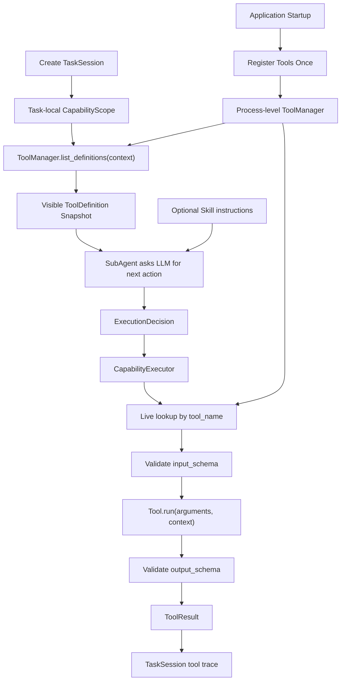

> [!WARNING]
> 本文档已被 `docs/runtime_tools_workflow_prd.md` 取代，仅保留为历史记录；其中的旧 DAG、route、presence、handoff 与多标识设计不再是现役契约。

# Ella Tool Runtime Refactor PRD

## 1. 背景

当前 Ella 的 Tool 边界耦合较重：

- `Tool` 主要只有 `name`、角色可见性和 `run()`。
- `SubAgent` 内部写死了 `going_out` 的工具调用顺序。
- LLM 无法获得完整的工具能力说明、参数格式和返回格式。
- Skill 与执行逻辑容易直接依赖具体 Tool 实现，而不是稳定的工具名称。
- Tool 参数主要来自固定规则，尚未形成统一的运行时校验边界。

目标架构应让 Tool 成为可自描述、可发现、可校验、可热插拔的运行时能力。LLM 根据当前任务可见的 Tool 定义判断是否需要调用工具；Skill 也可以通过唯一 Tool 名称声明所需能力。

这是一组渐进式 Tool Runtime 重构 PR 的技术 PRD，不是单个代码 PR。每个实施 PR 必须只修改一个模块边界，并保持当前 demo 可运行。

## 2. 产品目标

本 PRD 要实现：

1. 每个 Tool 具有唯一稳定名称和结构化描述。
2. Tool 描述可转换为 LLM 可理解的工具候选信息。
3. Tool 定义包含输入 JSON Schema、输入示例和输出 JSON Schema。
4. Tool 输入在执行前校验，输出在执行后校验。
5. Tool 在应用启动或插件加载时注册一次，而不是每个任务重复注册。
6. ToolManager 是进程级、长期存活的能力目录。
7. 每个 TaskSession 只持有允许使用的 Tool 名称范围，不持有 Tool 实例。
8. LLM 只看到当前任务可见且允许的 ToolDefinition 快照。
9. Executor 根据 LLM 返回的 `tool_name` 和参数实时查询 ToolManager 并执行。
10. Skill 通过唯一 Tool 名称引用工具，不直接依赖 Tool 对象。
11. Tool 的注册、移除和替换可以被后续规划与执行实时观察。

## 3. 非目标

本 PRD 不实现：

- 用户登录、身份认证或数据库权限系统。
- Tool 市场、远程插件中心或 MCP。
- 并发任务调度。
- 浏览器中的 Tool 管理页面。
- 自动安装第三方 Tool。
- 允许 LLM 绕过 Executor 直接调用 Tool。
- 让 TaskRuntime 或 TaskSession 持有 Tool 实例。
- 每次任务提交时重新注册全部 Tool。
- 将某个具体 workflow 写死进 ToolManager。
- 让 ToolManager 变成执行器。
- 在 Tool Runtime 重构早期强行接入 provider 原生 tool calling。
- 让 Skill.required_tools 直接驱动 Executor 全量执行。

## 4. 核心原则

### 4.1 Tool 自描述

Tool 必须向外提供结构化 `ToolDefinition`。建议数据形态：

```python
ToolDefinition(
    name="get_weather",
    description=(
        "Get the current weather in a given location. "
        "Use when the task needs current weather information. "
        "Do not use for historical climate analysis."
    ),
    schema_version="1.0",
    input_schema={
        "type": "object",
        "properties": {
            "location": {
                "type": "string",
                "description": "The city and state, e.g. San Francisco, CA",
            },
            "unit": {
                "type": "string",
                "enum": ["celsius", "fahrenheit"],
                "description": "The unit of temperature",
            },
        },
        "required": ["location"],
    },
    input_examples=(
        {"location": "San Francisco, CA", "unit": "fahrenheit"},
        {"location": "Tokyo, Japan", "unit": "celsius"},
        {"location": "New York, NY"},
    ),
    output_schema={
        "type": "object",
        "properties": {
            "summary": {"type": "string"},
            "temperature": {"type": "number"},
            "unit": {"type": "string"},
        },
        "required": ["summary"],
    },
)
```

`description` 使用自然语言统一说明：

- Tool 有什么作用。
- 什么时候应该使用。
- 什么时候不应该使用。
- 关键限制或副作用。

第一版不额外拆分 `when_to_use` 和 `when_not_to_use` 字段，保持与主流 function calling 格式接近。

### 4.2 名称是唯一定位标识

`ToolDefinition.name` 是 Tool 的唯一稳定标识。

要求：

- 同一 ToolManager 中名称不可重复。
- 注册同名 Tool 时必须明确拒绝，或使用独立的显式替换接口。
- LLM 返回 `tool_name` 后，Executor 通过该名称查询 ToolManager。
- Skill 只记录 Tool 名称，不保存 Tool 实例。
- ToolResult 必须保留实际执行的 `tool_name`。

### 4.3 注册是进程级行为

Tool 生命周期：

```text
应用启动 / 插件加载
→ 创建 ToolManager
→ 注册 Tool
→ ToolManager 在进程生命周期内持有 Tool 目录
```

任务生命周期：

```text
创建 TaskSession
→ 解析当前任务允许的 Tool 名称
→ 获取当前可见 ToolDefinition 快照
→ 交给 LLM 选择
→ Executor 实时查询并执行
```

因此：

- 不为每个任务重新注册 Tool。
- 不为每次 LLM 调用重新注册 Tool。
- TaskRuntime 不定义 Tool 列表。
- TaskSession 不持有 Tool 对象。
- AgentExecutionContext 只保存任务本地的权限名称快照。
- 第一版若没有明确稳定的 role 模型，不得为了 `allowed_roles` 大规模改造 `AgentExecutionContext`；应先使用 `main_agent` 等兼容默认值，把完整 role/policy 扩展留给独立 PR。

### 4.4 发现和执行是两个边界

ToolManager 只负责目录管理和发现，不执行 Tool。它至少提供：

```python
tool_manager.list_definitions(context)
tool_manager.get_tool(tool_name)
```

发现阶段：

- 根据 agent role 过滤不可见 Tool。
- 根据 `AgentExecutionContext.capability_scope.allowed_tools` 过滤无权限 Tool。
- 发现结果必须是以下集合的交集：

```text
registered_tools
∩ role_visible_tools
∩ task_allowed_tools
```

- 返回不可变的 ToolDefinition 快照。
- 不返回 Tool 实例给 LLM、TaskSession 或页面。

执行阶段：

- 执行阶段属于 CapabilityExecutor，不属于 ToolManager。
- CapabilityExecutor 根据 `tool_name` 向 ToolManager 实时查询 Tool。
- 再次检查角色可见性。
- 再次检查任务权限范围。
- 检查 Tool 是否仍然注册。
- 校验输入参数。
- 执行一次 Tool 调用。
- 校验输出结果。

一句话边界：

```text
ToolManager 管目录；SubAgent 选能力；CapabilityExecutor 校验并执行；Tool 只实现能力。
```

### 4.5 热插拔语义

ToolManager 是实时能力目录：

```text
register(tool)
unregister(tool_name)
replace(tool_name, tool, *, force=False)  # 可选显式接口
```

规则：

- 新注册 Tool 可被新任务发现。
- 现有任务不能因为 Tool 后加入就自动突破自己的 `allowed_tools` 权限范围。
- Tool 被移除后，现有任务在下一次执行或重规划时必须观察到不可用。
- LLM 规划时看到的 ToolDefinition 是当次规划快照，不是永久引用。
- Executor 执行时必须重新查询实时 ToolManager，不能依赖规划阶段缓存的 Tool 对象。
- ToolDefinition 必须包含 `schema_version`。
- `replace()` 默认要求新旧 ToolDefinition 的 `input_schema` 和 `output_schema` 兼容。
- 不兼容替换必须显式 `force=True`。
- `force=True` 替换只保证影响新规划和新任务；正在运行的任务执行前仍需实时查询 ToolManager，并在不兼容时失败或触发 REPLAN。

## 5. 数据契约

### 5.1 ToolDefinition

建议字段：

```python
@dataclass(frozen=True, slots=True)
class ToolDefinition:
    name: str
    description: str
    schema_version: str
    input_schema: dict[str, object]
    input_examples: tuple[dict[str, object], ...]
    output_schema: dict[str, object]
```

约束：

- `name` 非空且符合稳定命名规则。
- `description` 非空。
- `schema_version` 非空，并在同名 Tool 的兼容性检查中使用。
- `input_schema` 顶层必须描述 object。
- `output_schema` 顶层必须描述 object。
- `input_examples` 必须逐个通过 input schema 校验。
- ToolDefinition 必须可序列化为 LLM provider 所需格式。
- ToolDefinition 本身不包含 Tool 实例或运行时资源。

进入 LLM 前的 ToolDefinition 必须裁剪为模型需要的公共字段：

```text
name
description
input_schema
必要的 input_examples
必要时包含精简 output_schema
```

不得进入 LLM 的内容：

```text
provider credentials
本地文件路径
内部 class 名
debug-only 字段
原始媒体
权限实现细节
```

### 5.2 Tool 接口

建议边界：

```python
class Tool(Protocol):
    definition: ToolDefinition
    allowed_roles: tuple[str, ...]

    def run(
        self,
        arguments: dict[str, object],
        context: AgentExecutionContext,
    ) -> ToolResult:
        ...
```

迁移策略：

- 第一阶段允许现有 Tool 使用 `arguments={}` 兼容运行。
- 旧 Tool 可以临时忽略 arguments。
- 后续 PR 再逐步让每个 Tool 使用 schema-defined arguments。
- 兼容层必须是过渡方案，不应长期保留两套并行调用接口。

Tool 实现负责具体能力，不负责：

- 决定自己是否应被调用。
- 选择其他 Tool。
- 修改 TaskSession 状态。
- 直接写 Memory。
- 直接生成最终用户回答。

### 5.3 ToolCallRequest

LLM 或 Skill 产生统一调用请求：

```python
@dataclass(frozen=True, slots=True)
class ToolCallRequest:
    tool_name: str
    arguments: dict[str, object]
    reason: str
```

该对象只表达“下一步要调用什么”，不持有 Tool 实例。

现有 `ExecutionDecision` 可以继续作为上层生命周期决定，并在 `CALL_TOOL` 时携带等价字段：

```text
tool_name
tool_input / arguments
reason
```

第一版应避免同时长期维护两套重复调用对象。如果 `ExecutionDecision` 足以表达 ToolCallRequest，应直接复用并收紧字段语义。

### 5.4 ToolResult

ToolResult 保持任务归属信息：

```text
tool_name
task_id
session_id
trace_id
payload
```

要求：

- `payload` 必须通过 ToolDefinition.output_schema 校验。
- 校验失败应返回结构化执行失败，不得把无效输出当作成功结果。
- `invalid_tool_output` 不得写入成功 tool trace。
- `invalid_tool_output` 不得进入 successful ToolResult list。
- `invalid_tool_output` 不得进入 final response prompt 作为可信事实。
- 显示专用数据、Prompt 摘要和 Memory 数据应通过明确投影隔离。
- 原始媒体、API key 和认证信息不得进入 LLM ToolDefinition 或 Memory。

## 6. LLM Tool 选择

### 6.1 输入给 LLM 的内容

每次需要决策下一步动作时，SubAgent 收集：

```text
任务目标
当前 AgentExecutionContext
已有 ToolResult 摘要
当前可见的 ToolDefinition 列表
当前 Skill 指令（如果存在）
```

然后通过 Prompt Engine / provider-neutral adapter 将 ToolDefinition 转换为模型可理解的工具候选信息。第一版不要求使用 provider 原生 tool/function calling；可以先要求 LLM 输出内部 JSON 决策。

LLM 只能选择传给它的 ToolDefinition，不允许生成任意未注册工具名称后直接执行。

### 6.2 LLM 输出

LLM 决策应归一化为：

```text
CALL_TOOL(tool_name, arguments, reason)
COMPLETE(reason)
WAIT(reason)
REPLAN(reason)
```

要求：

- 每次只返回一个动作。
- `CALL_TOOL` 必须包含工具名称和参数对象。
- 参数必须经过 input schema 校验。
- LLM 输出非法 JSON、未知 action、缺少 action、缺少 `tool_name` 或缺少必需参数时，不得执行 Tool。
- 非法模型输出必须归一化为结构化失败、REPLAN 或 blocked 结果，供 TaskRuntime 按状态机处理。
- 未知 Tool 名称不能执行，应进入结构化失败或 REPLAN。
- LLM 不直接获得 Tool 对象，也不直接调用 ToolManager。

### 6.3 Provider 适配

不同 LLM provider 的原生 tool calling 格式可以不同，但 Ella 内部必须统一使用 ToolDefinition。

```text
ToolDefinition
→ Provider adapter
→ Qwen/OpenAI/其他模型的 tools 参数
→ Provider response
→ ExecutionDecision
```

Provider 特有字段不得泄漏到 SubAgent、TaskRuntime 或 Tool 实现。

原生 provider tool calling 应后置实现：

```text
第一阶段：LLM 输出内部 JSON 决策
第二阶段：Provider-neutral ToolDefinition serialization
第三阶段：Qwen / OpenAI 等 provider 原生 tool adapter
```

## 7. Skill 与 Tool 的关系

Skill 是任务经验和策略说明，不是 Tool 容器。

Skill 可以声明：

```text
required_tools:
  - camera_scene
  - get_weather

optional_tools:
  - checklist
```

规则：

- Skill 只按唯一名称引用 Tool。
- 加载 Skill 时可以检查引用名称是否存在，但不能缓存 Tool 实例。
- Skill 指定 `required_tools` 时，SubAgent 仍需检查任务权限和实时可用性。
- Skill 可以指导何时调用 Tool，但 ToolManager 仍是唯一 Tool 目录。
- Skill.required_tools 不是强制执行计划，不允许直接驱动 Executor 全量执行。
- Tool 被移除后，Skill 不得绕过 ToolManager 继续调用。
- Skill 未指定 Tool 时，LLM 可以根据可见 ToolDefinition 自主选择。

删除旧的 going_out 硬编码工具序列后，mock-safe 模式仍必须保留 deterministic tool decision fallback。也就是说，在默认 mock provider、无真实 LLM 或 LLM 输出不可用时，going_out demo 仍应能通过确定性规则产生可测试的下一步决策，不能因为完全依赖模型决策而失去基础演示能力。

## 8. 输入和输出校验

### 8.1 输入校验

Executor 在调用 Tool 前：

1. 查询实时 ToolManager。
2. 检查角色和任务权限。
3. 读取 ToolDefinition.input_schema。
4. 校验 LLM 或 Skill 提供的 arguments。
5. 校验失败时返回结构化错误，不调用 Tool。

错误至少包含：

```text
tool_name
error_code = invalid_tool_input
validation_path
message
```

### 8.2 输出校验

Tool 执行后：

1. 获取 ToolResult.payload。
2. 按 ToolDefinition.output_schema 校验。
3. 校验通过后写入 task-local tool trace。
4. 校验失败返回结构化错误，并允许 SubAgent REPLAN。

错误至少包含：

```text
tool_name
error_code = invalid_tool_output
validation_path
message
```

### 8.3 校验实现

优先使用成熟 JSON Schema 校验库，不手写完整 Schema 解析器。

第一版只需支持 ToolDefinition 使用到的 JSON Schema 子集，但接口不得阻止后续扩展。建议首版只覆盖：

```text
type
properties
required
enum
additionalProperties
array items
string / number / boolean / object / array
```

首版不要求支持：

```text
oneOf
anyOf
allOf
$ref
patternProperties
复杂 format
```

## 9. 目标运行时流程



## 10. 模块职责

### Tool 实现

- 提供 ToolDefinition。
- 接收格式化 arguments 和 AgentExecutionContext。
- 执行单次有界操作。
- 返回符合 output schema 的 ToolResult。

### ToolManager

- 进程级注册、移除、查询 Tool。
- 根据角色和任务权限过滤 ToolDefinition。
- 提供实时可用性查询。
- 不决定调用哪个 Tool。
- 不执行 Tool。
- 不校验 Tool 输入或输出。

### SubAgent

- 获取当前可见 ToolDefinition。
- 将任务上下文、Skill 指令和 ToolDefinition 交给 LLM。
- 把模型输出归一化为单个 ExecutionDecision。
- 不持有 Tool 实例。

### CapabilityExecutor

- 根据名称实时查询 ToolManager。
- 校验输入 Schema。
- 执行一个 Tool 动作。
- 校验输出 Schema。
- 返回结构化执行结果。
- 不决定任务目标或工具选择策略。

### TaskRuntime

- 管理任务状态推进。
- 调用 SubAgent 和 CapabilityExecutor。
- 不注册 Tool。
- 不维护 ToolDefinition。
- 不包含具体 Tool 名称。
- `WAIT` / `REPLAN` 必须受 `max_steps`、`max_replans` 或等价保护，避免模型输出或工具不可用导致无限循环。

### SkillManager

- 加载 Skill metadata 和完整 Skill 内容。
- Skill 中只保存 Tool 名称引用。
- 不注册或执行 Tool。

## 11. 当前仓库命名约定

本 PRD 必须沿用当前仓库已有边界，不新增平行体系：

```text
ToolManager: tools/manager.py
ToolRegistry: registries/tool_registry.py
CapabilityExecutor: sessions/executor.py
Tool / ToolResult / ToolDefinition: tools/base.py
```

规则：

- `ToolManager` 是对外目录服务，内部可以继续使用 `ToolRegistry` 存储。
- 如果 `ToolManager` 内部使用 `ToolRegistry`，则 `ToolRegistry` 必须是唯一 Tool 存储来源；不得在 `ToolManager` 中再维护第二份 Tool 映射，避免注册、移除、热插拔状态不一致。
- 不创建第二套 `tool_registry.py` 或第二个 ToolManager。
- 不把 CapabilityExecutor 从 `sessions/` 迁移到 `runtime/`。
- 如果未来要合并 ToolRegistry 与 ToolManager，必须单独 PR，且不能和 ToolDefinition、SubAgent 决策或 schema 校验混在一起。

## 12. 迁移当前实现

当前需要逐步移除的耦合包括：

```text
GOING_OUT_TOOL_SEQUENCE
GOING_OUT_VISUAL_TOOL_SEQUENCE
SubAgent 中写死的 mock_weather / mock_checklist / camera_scene 顺序
Tool 只有 name 和 run() 的薄接口
Executor 忽略 ExecutionDecision.tool_input
ToolManager 只能列名称，不能列 ToolDefinition
```

迁移期间必须保持：

- 当前 `going_out` demo 可运行。
- ToolManager 仍为进程级服务。
- AgentExecutionContext 仍是任务本地权限边界。
- Tool 被移除后执行会失败并触发 REPLAN。
- 默认测试不访问真实网络或设备。

## 13. 实施 PR 拆分

该改造不得一次完成，应按单一边界拆分。

### PR 1：ToolDefinition 数据契约

单一目标：增加 ToolDefinition、输入示例和输入输出 Schema 数据契约。

建议文件：

```text
tools/base.py
tests/tools/test_tool_definition.py
```

不修改 ToolManager、SubAgent、Executor 或现有 Tool 行为。

### PR 2：现有 Tool 提供结构化定义

单一目标：让 mock tools 和 CameraSceneTool 声明 ToolDefinition。

建议文件：

```text
tools/mock_tools.py
tools/camera_scene.py
tests/tools/test_tool_definitions.py
```

不修改 Tool 选择或执行逻辑。第一阶段允许现有 Tool 继续忽略 `arguments={}`。

### PR 3：ToolManager 定义发现接口

单一目标：按角色和任务权限返回当前可见 ToolDefinition。

建议文件：

```text
tools/manager.py
tests/tools/test_tool_definition_discovery.py
```

注册仍发生在应用启动；不得在任务创建时重复注册。该 PR 只允许增加 `get_tool()` 和 `list_definitions(context)` 等目录/发现能力，不允许让 ToolManager 执行 Tool。

### PR 4：Tool 参数与结果 Schema 校验

单一目标：Executor 执行前后进行 JSON Schema 校验。

建议文件：

```text
sessions/executor.py
pyproject.toml
tests/sessions/test_tool_schema_validation.py
```

若新增依赖需要修改依赖文件，必须在该 PR 中明确允许。输出校验失败不得写入成功 tool trace，也不得作为可信事实进入 final response prompt。

### PR 5a：Provider-neutral ToolDefinition 序列化

单一目标：把内部 ToolDefinition 裁剪并序列化为 provider-neutral 的 LLM 输入格式。

建议文件：

```text
providers/llm.py
providers/mock.py
prompts/engine.py
tests/providers/test_tool_definition_serialization.py
```

该 PR 不接入 Qwen 原生 tool calling，不修改 SubAgent 执行策略。

### PR 5b：SubAgent 使用可见 ToolDefinition 决策

单一目标：SubAgent 读取当前可见 ToolDefinition，并让 LLM 返回单步内部 JSON ExecutionDecision。

建议文件：

```text
sessions/subagent.py
tests/sessions/test_llm_tool_decision.py
```

该 PR 不实现 provider 原生 tools 参数，不执行 Tool。

### PR 5c：Provider 原生 tool calling 适配

单一目标：在内部闭环稳定后，为 Qwen 或其他 provider 增加原生 tool calling adapter。

建议文件：

```text
providers/qwen.py
providers/factory.py
tests/providers/test_qwen_tool_calling_adapter.py
```

该 PR 不修改 Tool、Executor、TaskRuntime 或 Skill 行为。

### PR 6：Skill 按名称声明 Tool 依赖

单一目标：Skill metadata 支持 required_tools 和 optional_tools。

建议文件：

```text
skill/registry.py
skill/loader.py
skill/skills/going_out/SKILL.md
tests/registries/test_skill_tool_references.py
```

Skill 不持有 Tool 实例。Skill.required_tools 不是直接执行计划。

### PR 7：移除 SubAgent 硬编码工具序列

单一目标：删除 `GOING_OUT_TOOL_SEQUENCE` 等硬编码流程，改由 Skill 指令与 LLM ToolDefinition 决策。

建议文件：

```text
sessions/subagent.py
tests/sessions/test_dynamic_tool_selection.py
```

该 PR 必须在 PR 1 至 PR 6 完成后实施，不得提前做。提前删除硬编码序列会直接破坏当前 going_out demo。

### PR 8：应用装配和契约回归

单一目标：确认 Tool 只在应用启动注册一次，并验证热插拔、权限和 Runtime 边界。

建议文件：

```text
demo/cli_demo.py
tests/contracts/test_tool_runtime_contract.py
```

不新增具体 Tool，不修改 TaskRuntime 状态机。

## 14. 测试要求

最终测试必须覆盖：

- ToolDefinition 可构造和序列化。
- ToolDefinition.schema_version 参与同名替换兼容性判断。
- Tool 名称唯一。
- 输入示例符合 input schema。
- ToolManager 只在应用装配时注册 Tool。
- ToolManager 不执行 Tool。
- ToolManager 内部若使用 ToolRegistry，则 ToolRegistry 是唯一 Tool 存储来源。
- 多个任务复用同一 ToolManager，不重复注册 Tool。
- 不同任务可得到不同的 ToolDefinition 可见范围。
- 发现阶段同时过滤注册状态、角色可见性和任务权限范围。
- LLM 只能看到当前任务允许的 ToolDefinition。
- 进入 LLM 的 ToolDefinition 不包含凭证、本地路径、内部 class 名、原始媒体或权限实现细节。
- LLM 可以返回 CALL_TOOL、COMPLETE、WAIT 或 REPLAN。
- LLM 输出非法 JSON、未知 action 或缺少参数时不会执行 Tool。
- WAIT / REPLAN 受 max_steps、max_replans 或等价机制保护。
- 未知 Tool 名称不能执行。
- 无效输入不会调用 Tool。
- 无效输出不会写入成功 tool trace。
- 无效输出不会作为可信事实进入 final response prompt。
- Tool 被移除后，已有任务下一次执行会观察到不可用。
- Tool 后加入不会绕过已有任务权限范围。
- Skill 可以通过名称引用 Tool。
- Skill 不缓存 Tool 实例。
- Skill.required_tools 不会绕过 SubAgent 和 Executor validation 直接执行。
- 删除 going_out 硬编码序列后，mock-safe 模式仍有 deterministic tool decision fallback。
- TaskRuntime 不包含具体 Tool 名称。
- 默认测试不访问真实网络、摄像头或麦克风。
- `python -m pytest` 通过。
- `python main.py` 可运行。

## 15. 验收标准

- [ ] Tool 具有结构化 ToolDefinition。
- [ ] ToolDefinition 包含 name、description、schema_version、input_schema、input_examples 和 output_schema。
- [ ] Tool 在应用启动或插件加载时注册一次。
- [ ] ToolManager 是进程级长期服务。
- [ ] ToolManager 只负责目录和发现，不执行 Tool。
- [ ] ToolRegistry 若被 ToolManager 使用，则是唯一 Tool 存储来源。
- [ ] TaskSession 和 AgentExecutionContext 不持有 Tool 实例。
- [ ] LLM 获得当前任务可见的 ToolDefinition 快照。
- [ ] LLM 可以根据任务自主判断是否调用 Tool。
- [ ] LLM 非法输出不会触发 Tool 执行。
- [ ] WAIT / REPLAN 不会造成无限循环。
- [ ] Executor 通过唯一名称实时定位 Tool。
- [ ] 输入和输出均经过 JSON Schema 校验。
- [ ] Skill 只通过唯一名称引用 Tool。
- [ ] Skill.required_tools 不是直接执行计划。
- [ ] SubAgent 不再写死 going_out 工具调用序列。
- [ ] 默认 mock-safe demo 在没有真实 LLM tool decision 时仍有确定性 fallback。
- [ ] Tool 热插拔不破坏任务权限边界。
- [ ] Runtime 主链路和当前 demo 保持可运行。

## 16. 最终目标

完成后，Ella 的 Tool 流程应为：

```text
Tool 在应用启动时注册一次
→ ToolManager 长期维护实时能力目录
→ TaskSession 获得任务本地权限范围
→ SubAgent 获取可见 ToolDefinition
→ LLM 判断是否需要调用 Tool
→ 返回 tool_name + arguments
→ Executor 实时查询 ToolManager
→ 校验输入
→ 执行一次 Tool
→ 校验输出
→ ToolResult 进入任务上下文
→ SubAgent 决定下一步
```

核心边界是：

```text
Tool 描述能力。
LLM 选择能力。
Executor 校验并执行能力。
ToolManager 管理实时能力目录。
Skill 只通过名称引用能力。
TaskRuntime 只管理生命周期。
```
